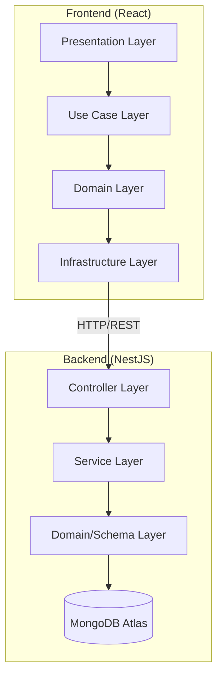
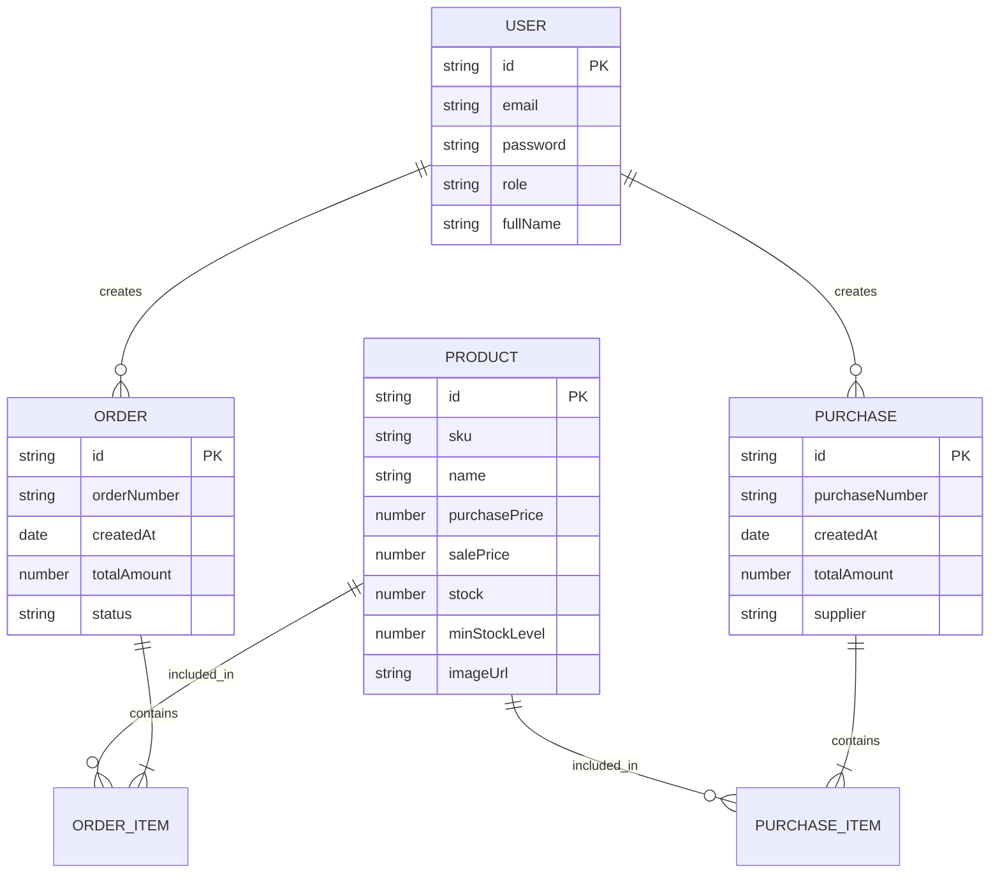

# TRƯỜNG ĐẠI HỌC CÔNG NGHỆ THÔNG TIN
# TRUNG TÂM PHÁT TRIỂN CÔNG NGHỆ THÔNG TIN

<br>
<br>
<br>

# <TÊN SINH VIÊN>

<br>
<br>

# CHUYÊN ĐỀ TỐT NGHIỆP
# XÂY DỰNG WEBSITE QUẢN LÝ BÁN HÀNG TẠP HOÁ TÍCH HỢP GỢI Ý NHẬP HÀNG

<br>
<br>
<br>
<br>

### GIẢNG VIÊN HƯỚNG DẪN
### ThS. Mai Xuân Hùng

<br>
<br>
<br>
<br>

### TP. HỒ CHÍ MINH, 2025

---

# LỜI CẢM ƠN

Lời đầu tiên, em xin gửi lời cảm ơn chân thành và sâu sắc nhất tới ThS. Mai Xuân Hùng, người đã trực tiếp hướng dẫn, chỉ bảo tận tình và đưa ra những định hướng quý báu trong suốt quá trình em thực hiện chuyên đề này. Sự hỗ trợ của thầy đã giúp em vượt qua nhiều khó khăn về mặt kỹ thuật cũng như phương pháp luận để hoàn thành sản phẩm một cách tốt nhất.

Em cũng xin gửi lời cảm ơn tới Ban Giám hiệu, các thầy cô giáo trường Đại học Công nghệ Thông tin đã truyền đạt cho em những kiến thức nền tảng vững chắc và tạo điều kiện thuận lợi nhất về môi trường học tập, nghiên cứu trong suốt những năm vừa qua.

Cuối cùng, em xin cảm ơn gia đình và bạn bè đã luôn động viên, giúp đỡ và ủng hộ em về mọi mặt để em có thể tập trung hoàn thành tốt chuyên đề tốt nghiệp của mình.

Dù đã có nhiều cố gắng, nhưng do hạn chế về thời gian và kiến thức, báo cáo chắc chắn không tránh khỏi những thiếu sót. Em rất mong nhận được những ý kiến đóng góp, phê bình từ quý thầy cô để chuyên đề này được hoàn thiện hơn.

Trân trọng cảm ơn.

---

# MỤC LỤC

1. [DANH MỤC HÌNH VẼ](#danh-mục-hình-vẽ)
2. [DANH MỤC BẢNG](#danh-mục-bảng)
3. [DANH MỤC TỪ VIẾT TẮT](#danh-mục-từ-viết-tắt)
4. [CHƯƠNG 1. TỔNG QUAN ĐỀ TÀI](#chương-1-tổng-quan-đề-tài)
    - [1.1. Lý do chọn đề tài](#11-lý-do-chọn-đề-tài)
    - [1.2. Mục tiêu đề tài](#12-mục-tiêu-đề-tài)
    - [1.3. Phạm vi và đối tượng nghiên cứu](#13-phạm-vi-và-đối-tượng-nghiên-cứu)
    - [1.4. Phương pháp thực hiện](#14-phương-pháp-thực-hiện)
    - [1.5. Kết cấu báo cáo](#15-kết-cấu-báo-cáo)
5. [CHƯƠNG 2. PHÂN TÍCH NGHIỆP VỤ VÀ YÊU CẦU HỆ THỐNG](#chương-2-phân-tích-nghiệp-vụ-và-yêu-cầu-hệ-thống)
    - [2.1. Mô tả nghiệp vụ cửa hàng tạp hoá](#21-mô-tả-nghiệp-vụ-cửa-hàng-tạp-hoá)
    - [2.2. Các tác nhân hệ thống](#22-các-tác nhân-hệ-thống)
    - [2.3. Use Case Diagram](#23-use-case-diagram)
    - [2.4. Đặc tả chức năng theo từng role](#24-đặc-tả-chức-năng-theo-từng-role)
    - [2.5. Yêu cầu phi chức năng](#25-yêu-cầu-phi-chức-năng)
6. [CHƯƠNG 3. THIẾT KẾ HỆ THỐNG](#chương-3-thiết-kế-hệ-thống)
    - [3.1. Kiến trúc tổng thể](#31-kiến-trúc-tổng-thể)
    - [3.2. Thiết kế CSDL (ERD)](#32-thiết-kế-csdl-erd)
    - [3.3. Thiết kế Backend (NestJS + DDD)](#33-thiết-kế-backend-nestjs--ddd)
    - [3.4. Thiết kế Frontend (React + DDD)](#34-thiết-kế-frontend-react--ddd)
    - [3.5. Phân quyền và bảo mật (RBAC)](#35-phân-quyền-và-bảo-mật-rbac)
7. [CHƯƠNG 4. TRIỂN KHAI VÀ KẾT QUẢ](#chương-4-triển-khai-và-kết-quả)
    - [4.1. Môi trường triển khai](#41-môi-trường-triển-khai)
    - [4.2. Triển khai Backend](#42-triển-khai-backend)
    - [4.3. Triển khai Frontend](#43-triển-khai-frontend)
    - [4.4. Kết quả đạt được](#44-kết-quả-đạt-được)
    - [4.5. Đánh giá hệ thống](#45-đánh-giá-hệ-thống)
8. [CHƯƠNG 5. KẾT LUẬN VÀ HƯỚNG PHÁT TRIỂN](#chương-5-kết-luận-và-hướng-phát-triển)
    - [5.1. Kết luận](#51-kết-luận)
    - [5.2. Hạn chế](#52-hạn-chế)
    - [5.3. Hướng phát triển tương lai](#53-hướng-phát-triển-tương-lai)
9. [TÀI LIỆU THAM KHẢO](#tài-liệu-tham-khảo)

---

# DANH MỤC HÌNH VẼ

- Hình 2.1: Sơ đồ Use Case tổng quát (E-Grocery)
- Hình 3.1: Kiến trúc hệ thống dựa trên Domain-Driven Design
- Hình 3.2: Sơ đồ thực thể mối quan hệ (ERD)
- Hình 3.3: Sequence Diagram – Quy trình bán hàng
- Hình 3.4: Sequence Diagram – Quy trình nhập hàng
- Hình 4.1: Giao diện Dashboard quản trị
- Hình 4.2: Giao diện quản lý danh mục sản phẩm
- Hình 4.3: Giao diện tạo phiếu nhập hàng và gợi ý tồn kho

---

# DANH MỤC BẢNG

- Bảng 2.1: Đặc tả tác nhân hệ thống
- Bảng 4.1: Danh sách công cụ triển khai backend
- Bảng 4.2: Danh sách công cụ triển khai frontend

---

# DANH MỤC TỪ VIẾT TẮT

- **API**: Application Programming Interface
- **CSDL**: Cơ sở dữ liệu
- **DDD**: Domain-Driven Design
- **DTO**: Data Transfer Object
- **ERD**: Entity Relationship Diagram
- **JWT**: JSON Web Token
- **RBAC**: Role-Based Access Control
- **SPA**: Single Page Application
- **UI/UX**: User Interface / User Experience

---

# CHƯƠNG 1. TỔNG QUAN ĐỀ TÀI

### 1.1. Lý do chọn đề tài

Trong bối cảnh chuyển đổi số mạnh mẽ hiện nay, việc ứng dụng công nghệ thông tin vào quản lý kinh doanh không còn là lựa chọn mà là yêu cầu bắt buộc đối với mọi loại hình doanh nghiệp, kể cả các cửa hàng bán lẻ truyền thống. Các cửa hàng tạp hóa tại Việt Nam thường đối mặt với các vấn đề:
- Quản lý thủ công gây thất thoát và sai sót số liệu.
- Khó khăn trong việc theo dõi tồn kho sát sao dẫn đến tình trạng hết hàng đột ngột hoặc hàng tồn đọng quá lâu.
- Việc nhập hàng thường dựa trên kinh nghiệm cảm tính, thiếu cơ sở dữ liệu phân tích.

Đề tài "Xây dựng website quản lý bán hàng tạp hoá tích hợp gợi ý nhập hàng" được lựa chọn nhằm cung cấp một giải pháp quản lý toàn diện, hiện đại hóa quy trình bán hàng và hỗ trợ ra quyết định nhập hàng dựa trên dữ liệu thực tế.

### 1.2. Mục tiêu đề tài

- Xây dựng hệ thống quản lý tập trung cho cửa hàng tạp hóa.
- Tự động hóa quy trình bán lẻ và quản lý kho.
- Phát triển tính năng gợi ý nhập hàng thông minh dựa trên ngưỡng tồn kho tối thiểu.
- Đảm bảo tính bảo mật và phân quyền rõ ràng giữa các nhân viên.

### 1.3. Phạm vi và đối tượng nghiên cứu

- **Đối tượng nghiên cứu**: Quy trình nghiệp vụ bán lẻ tạp hóa, kiến trúc Domain-Driven Design (DDD), Framework NestJS và React.
- **Phạm vi hệ thống (Chuyên đề)**: Tập trung vào phân hệ quản trị (Back-office).
    - Quản lý sản phẩm, danh mục, giá cả.
    - Quản lý quy trình bán hàng tại quầy.
    - Quản lý nhập hàng và nhà cung cấp.
    - Hệ thống cảnh báo và gợi ý tồn kho.
    - Báo cáo doanh thu và dashboard thống kê.
- **Tác nhân**: Quản trị viên (Admin) và Nhân viên (Staff).

### 1.4. Phương pháp thực hiện

- Nghiên cứu lý thuyết về kiến trúc phần mềm DDD.
- Khảo sát quy trình thực tế tại các cửa hàng bán lẻ.
- Sử dụng mô hình Agile/Scrum để phát triển phần mềm theo từng giai đoạn.
- Đánh giá và kiểm thử hệ thống trên dữ liệu giả định.

### 1.5. Kết cấu báo cáo

Báo cáo được chia làm 5 chương:
- Chương 1: Tổng quan đề tài.
- Chương 2: Phân tích nghiệp vụ và yêu cầu hệ thống.
- Chương 3: Thiết kế hệ thống.
- Chương 4: Triển khai và kết quả.
- Chương 5: Kết luận và hướng phát triển.

---

# CHƯƠNG 2. PHÂN TÍCH NGHIỆP VỤ VÀ YÊU CẦU HỆ THỐNG

### 2.1. Mô tả nghiệp vụ cửa hàng tạp hoá

Quy trình hoạt động chính bao gồm:
1. **Quản lý kho**: Tiếp nhận hàng hóa, kiểm kê số lượng, cập nhật giá nhập và giá bán.
2. **Bán hàng**: Nhân viên chọn sản phẩm, áp dụng số lượng, tính tiền và in hóa đơn (phiếu đơn hàng).
3. **Nhập hàng**: Dựa trên báo cáo tồn kho, Admin thực hiện tạo phiếu nhập hàng từ các nhà cung cấp.

### 2.2. Các tác nhân hệ thống

| Tác nhân | Mô tả |
| :--- | :--- |
| **Admin** | Có toàn quyền điều hành hệ thống: quản lý người dùng, sản phẩm, báo cáo tài chính và cấu hình hệ thống. |
| **Staff** | Nhân viên bán hàng: thực hiện bán hàng, xem tồn kho, tạo phiếu nhập (tùy quyền hạn) và quản lý sản phẩm cơ bản. |

### 2.3. Use Case Diagram

```mermaid
useCaseDiagram
    actor "Admin" as admin
    actor "Staff" as staff

    package "Hệ thống Quản lý Tạp hóa" {
        usecase "Đăng nhập" as UC1
        usecase "Quản lý Sản phẩm" as UC2
        usecase "Quản lý Bán hàng" as UC3
        usecase "Quản lý Nhập hàng" as UC4
        usecase "Xem Báo cáo Doanh thu" as UC5
        usecase "Quản lý Tồn kho" as UC6
        usecase "Cấu hình Hệ thống" as UC7
    }

    staff --> UC1
    staff --> UC2
    staff --> UC3
    staff --> UC6

    admin --> UC1
    admin --> UC2
    admin --> UC3
    admin --> UC4
    admin --> UC5
    admin --> UC6
    admin --> UC7
```

### 2.4. Đặc tả chức năng theo từng role

- **Quản trị viên (Admin)**:
    - Quản lý tài khoản nhân viên (Thêm/Sửa/Xóa/Khóa).
    - Xem báo cáo tổng hợp: doanh thu, lợi nhuận, biểu đồ tăng trưởng.
    - Phê duyệt và quản lý các phiếu nhập hàng quy mô lớn.
    - Quản lý danh mục sản phẩm nâng cao.
- **Nhân viên (Staff)**:
    - Thực hiện giao dịch bán hàng nhanh chóng.
    - Cập nhật số lượng sản phẩm thực tế khi kiểm kho.
    - Nhận thông báo về các sản phẩm sắp hết hàng.

### 2.5. Yêu cầu phi chức năng

- **Hiệu năng**: Thời gian phản hồi API không quá 500ms đối với các tác vụ thông thường.
- **Bảo mật**: Mật khẩu được băm (hashing), dữ liệu truyền tải qua HTTPS, xác thực bằng JWT.
- **Giao diện**: Thân thiện, hỗ trợ Dark/Light mode, responsive tốt trên máy tính bảng và desktop.

---

# CHƯƠNG 3. THIẾT KẾ HỆ THỐNG

### 3.1. Kiến trúc tổng thể

Hệ thống được thiết kế theo kiến trúc phân tầng (Layered Architecture) kết hợp với tư duy Domain-Driven Design (DDD) để tách biệt rõ ràng các mối quan tâm.



### 3.2. Thiết kế CSDL (ERD)



### 3.3. Thiết kế Backend (NestJS + DDD)

Backend được tổ chức thành các "Phân hệ" (Modules), mỗi phân hệ chịu trách nhiệm cho một miền dữ liệu cụ thể:
- **Presentation**: Chứa các Controllers định nghĩa API Endpoints.
- **Application**: Chứa các Services xử lý logic nghiệp vụ.
- **Domain**: Chứa Schemas (Mongoose) và Entities.
- **Infrastructure**: Chứa cấu hình CSDL, bảo mật và các tiện ích.

### 3.4. Thiết kế Frontend (React + DDD)

Frontend áp dụng cấu trúc tương tự để đảm bảo tính dễ bảo trì:
- **Lĩnh vực (Domain)**: Chứa logic nghiệp vụ client-side, entities và repositories.
- **Giao diện (Presentation)**: Các Components, Pages và Layouts.
- **Hạ tầng (Infrastructure)**: API clients, formatters.
- **Kho trạng thái (State)**: Quản lý state toàn cục bằng Zustand.

### 3.5. Phân quyền và bảo mật (RBAC)

Hệ thống sử dụng cơ chế Role-Based Access Control:
- **Guard**: Bảo vệ các route bằng `BaoVeJwt` và `BaoVeVaiTro`.
- **Decorator**: Sử dụng `@VaiTro()` để đánh dấu các quyền hạn cần thiết tại Controller.
- **Frontend Protection**: Các menu và trang được ẩn/hiện dựa trên thông tin role trong `authStore`.

---

# CHƯƠNG 4. TRIỂN KHAI VÀ KẾT QUẢ

### 4.1. Môi trường triển khai

- **Hệ điều hành**: Windows 10/11, Linux (Ubuntu).
- **Ngôn ngữ**: TypeScript.
- **Môi trường runtime**: Node.js v18+.
- **Cơ sở dữ liệu**: MongoDB Atlas (Cloud).

### 4.2. Triển khai Backend

- Framework: NestJS.
- Thư viện chính: Mongoose (ODM), Passport.js (Auth), Class-validator (Validation).
- API Documentation: Swagger UI.

### 4.3. Triển khai Frontend

- Framework: React 18 với Vite.
- Styling: Tailwind CSS.
- Icons: Lucide React.
- State management: Zustand.

### 4.4. Kết quả đạt được

Hệ thống đã hoàn thiện các tính năng cốt lõi:
- Đăng nhập, đăng xuất và quản lý phiên làm việc.
- Quản lý danh mục sản phẩm với hình ảnh và mã vạch.
- Bán hàng tại quầy với quy trình chọn sản phẩm – tạo đơn – cập nhật kho tự động.
- Hệ thống cảnh báo tồn kho thấp hiển thị ngay trên Dashboard.
- Gợi ý danh sách sản phẩm cần nhập hàng dựa trên số lượng tồn kho.

### 4.5. Đánh giá hệ thống

- **Ưu điểm**: Giao diện hiện đại, dễ sử dụng, tốc độ phản hồi nhanh, kiến trúc code sạch sẽ dễ mở rộng.
- **Nhược điểm**: Chưa có tính năng in hóa đơn trực tiếp ra máy in nhiệt (mới xuất file PDF/Giao diện).

---

# CHƯƠNG 5. KẾT LUẬN VÀ HƯỚNG PHÁT TRIỂN

### 5.1. Kết luận

Chuyên đề đã giải quyết tốt bài toán quản lý bán hàng cho các cửa hàng tạp hóa vừa và nhỏ. Việc áp dụng kiến trúc DDD giúp mã nguồn được tổ chức khoa học, giảm thiểu rủi ro khi thay đổi yêu cầu nghiệp vụ.

### 5.2. Hạn chế

- Hệ thống chưa hỗ trợ đa ngôn ngữ (mới chỉ có Tiếng Việt).
- Chưa tích hợp các phương thức thanh toán điện tử (VNPay, Momo).

### 5.3. Hướng phát triển tương lai

- Phát triển phân hệ dành riêng cho khách hàng để xem sản phẩm và đặt hàng trực tuyến.
- Tích hợp AI để dự báo nhu cầu tiêu thụ hàng hóa chính xác hơn theo mùa.
- Phát triển ứng dụng di động cho cả nhân viên và khách hàng.

---

# TÀI LIỆU THAM KHẢO

**Tài liệu tiếng Việt**
1. Nguyễn Văn A, "Giáo trình Phân tích và Thiết kế hệ thống thông tin", Nhà xuất bản Giáo dục, 2022.
2. Tài liệu hướng dẫn NestJS Tiếng Việt, Cộng đồng lập trình viên Việt Nam.

**Tài liệu tiếng Anh**
1. Eric Evans, "Domain-Driven Design: Tackling Complexity in the Heart of Software", Addison-Wesley Professional, 2003.
2. NestJS Documentation, official website: https://docs.nestjs.com.
3. React Documentation, official website: https://react.dev.
4. MongoDB Documentation, official website: https://docs.mongodb.com.

