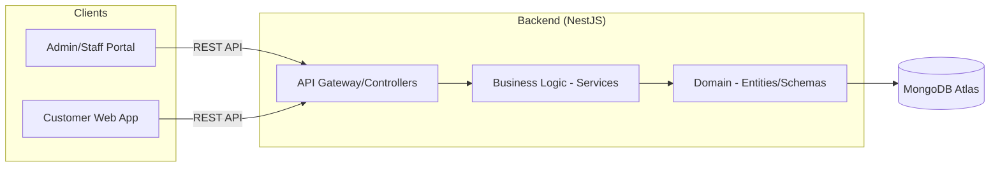
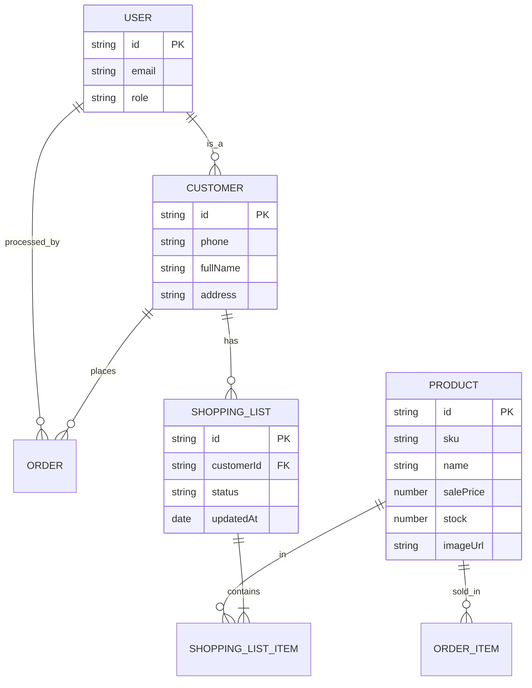

# TRƯỜNG ĐẠI HỌC CÔNG NGHỆ THÔNG TIN
# TRUNG TÂM PHÁT TRIỂN CÔNG NGHỆ THÔNG TIN

<br>
<br>
<br>

# <TÊN SINH VIÊN>

<br>
<br>

# ĐỒ ÁN TỐT NGHIỆP
# XÂY DỰNG WEBSITE QUẢN LÝ BÁN HÀNG TẠP HOÁ TÍCH HỢP GỢI Ý NHẬP HÀNG

<br>
<br>
<br>
<br>

### GIẢNG VIÊN HƯỚNG DẪN
### ThS. Mai Xuân Hùng

<br>
<br>
<br>
<br>

### TP. HỒ CHÍ MINH, 2025

---

# LỜI CẢM ƠN

Lời đầu tiên, em xin bày tỏ lòng biết ơn chân thành đến Ban Giám hiệu trường Đại học Công nghệ Thông tin cùng quý thầy cô giáo trong Trung tâm Phát triển Công nghệ Thông tin đã truyền dạy những kiến thức chuyên môn quý báu và rèn luyện kỹ năng tư duy trong suốt quá trình em học tập tại trường.

Đặc biệt, em xin gửi lời cảm ơn sâu sắc nhất tới thầy hướng dẫn – ThS. Mai Xuân Hùng. Thầy đã tận tình hướng dẫn, dành nhiều thời gian quý báu để định hướng, góp ý và động viên em trong từng giai đoạn thực hiện đồ án. Những kiến thức và kinh nghiệm thực tế thầy chia sẻ là hành trang vô giá cho em trên con đường sự nghiệp sau này.

Em cũng xin gửi lời cảm ơn tới gia đình, bạn bè và những người thân yêu đã luôn là chỗ dựa vững chắc, khích lệ tinh thần và tạo điều kiện tốt nhất để em hoàn thành đồ án tốt nghiệp này.

Mặc dù đã cố gắng vận dụng những kiến thức đã học và tìm hiểu thêm các công nghệ mới, đồ án chắc chắn vẫn còn những điểm hạn chế. Em rất mong nhận được những lời góp ý quý báu từ Hội đồng chấm đồ án để em có thể hoàn thiện sản phẩm cũng như kiến thức của mình một cách tốt hơn.

Trân trọng cảm ơn.

---

# MỤC LỤC

1. [DANH MỤC HÌNH VẼ](#danh-mục-hình-vẽ)
2. [DANH MỤC BẢNG](#danh-mục-bảng)
3. [DANH MỤC TỪ VIẾT TẮT](#danh-mục-từ-viết-tắt)
4. [CHƯƠNG 1. TỔNG QUAN ĐỀ TÀI](#chương-1-tổng-quan-đề-tài)
    - [1.1. Lý do chọn đề tài](#11-lý-do-chọn-đề-tài)
    - [1.2. Mục tiêu đề tài](#12-mục-tiêu-đề-tài)
    - [1.3. Phạm vi và đối tượng nghiên cứu](#13-phạm-vi-và-đối-tượng-nghiên-cứu)
    - [1.4. Phương pháp thực hiện](#14-phương-pháp-thực-hiện)
    - [1.5. Kết cấu báo cáo](#15-kết-cấu-báo-cáo)
5. [CHƯƠNG 2. PHÂN TÍCH NGHIỆP VỤ VÀ YÊU CẦU HỆ THỐNG](#chương-2-phân-tích-nghiệp-vụ-và-yêu-cầu-hệ-thống)
    - [2.1. Mô tả nghiệp vụ cửa hàng tạp hoá](#21-mô-tả-nghiệp-vụ-cửa-hàng-tạp-hoá)
    - [2.2. Các tác nhân hệ thống](#22-các-tác-nhân-hệ-thống)
    - [2.3. Use Case Diagram](#23-use-case-diagram)
    - [2.4. Đặc tả chức năng theo từng role](#24-đặc-tả-chức-năng-theo-từng-role)
    - [2.5. Yêu cầu phi chức năng](#25-yêu-cầu-phi-chức-năng)
6. [CHƯƠNG 3. THIẾT KẾ HỆ THỐNG](#chương-3-thiết-kế-hệ-thống)
    - [3.1. Kiến trúc tổng thể](#31-kiến-trúc-tổng-thể)
    - [3.2. Thiết kế CSDL (ERD)](#32-thiết-kế-csdl-erd)
    - [3.3. Thiết kế Backend (NestJS + DDD)](#33-thiết-kế-backend-nestjs--ddd)
    - [3.4. Thiết kế Frontend (React + DDD)](#34-thiết-kế-frontend-react--ddd)
    - [3.5. Phân quyền và bảo mật (RBAC)](#35-phân-quyền-và-bảo-mật-rbac)
7. [CHƯƠNG 4. TRIỂN KHAI VÀ KẾT QUẢ](#chương-4-triển-khai-và-kết-quả)
    - [4.1. Môi trường triển khai](#41-môi-trường-triển-khai)
    - [4.2. Triển khai Backend](#42-triển-khai-backend)
    - [4.3. Triển khai Frontend](#43-triển-khai-frontend)
    - [4.4. Kết quả đạt được](#44-kết-quả-đạt-được)
    - [4.5. Đánh giá hệ thống](#45-đánh-giá-hệ-thống)
8. [CHƯƠNG 5. KẾT LUẬN VÀ HƯỚNG PHÁT TRIỂN](#chương-5-kết-luận-và-hướng-phát-triển)
    - [5.1. Kết luận](#51-kết-luận)
    - [5.2. Hạn chế](#52-hạn-chế)
    - [5.3. Hướng phát triển tương lai](#53-hướng-phát-triển-tương-lai)
9. [TÀI LIỆU THAM KHẢO](#tài-liệu-tham-khảo)

---

# DANH MỤC HÌNH VẼ

- Hình 2.1: Sơ đồ Use Case tổng quát (E-Grocery Full System)
- Hình 3.1: Kiến trúc hệ thống đa tầng và tương tác Clients
- Hình 3.2: Sơ đồ thực thể mối quan hệ (ERD) – Toàn hệ thống
- Hình 3.3: Sequence Diagram – Quy trình mua hàng của khách hàng
- Hình 3.4: Sequence Diagram – Quy trình gợi ý nhập hàng
- Hình 4.1: Giao diện Trang chủ khách hàng
- Hình 4.2: Giao diện Quản lý giỏ hàng và Danh sách mua hàng
- Hình 4.3: Dashboard quản trị dành cho Admin
- Hình 4.4: Biểu đồ báo cáo doanh thu theo thời gian

---

# DANH MỤC BẢNG

- Bảng 2.1: Danh sách các tác nhân và mô tả vai trò
- Bảng 3.1: Định nghĩa các Schema chính trong MongoDB
- Bảng 4.1: Danh sách các công nghệ sử dụng triển khai hệ thống

---

# DANH MỤC TỪ VIẾT TẮT

- **API**: Application Programming Interface
- **CSDL**: Cơ sở dữ liệu
- **DDD**: Domain-Driven Design
- **DTO**: Data Transfer Object
- **ERD**: Entity Relationship Diagram
- **JWT**: JSON Web Token
- **RBAC**: Role-Based Access Control
- **REST**: Representational State Transfer
- **SPA**: Single Page Application
- **UI/UX**: User Interface / User Experience

---

# CHƯƠNG 1. TỔNG QUAN ĐỀ TÀI

### 1.1. Lý do chọn đề tài

Ngành bán lẻ tạp hóa đóng vai trò huyết mạch trong tiêu dùng tại Việt Nam. Tuy nhiên, sự cạnh tranh từ các chuỗi cửa hàng tiện lợi và siêu thị lớn đang gây áp lực lên các cửa hàng truyền thống. Để tồn tại, các cửa hàng tạp hóa cần tối ưu hóa quy trình quản trị và tăng cường sự gắn kết với khách hàng.

Đề tài "Xây dựng website quản lý bán hàng tạp hoá tích hợp gợi ý nhập hàng" không chỉ giải quyết bài toán quản lý kho bãi, bán hàng nội bộ mà còn hướng đến việc xây dựng một kênh tương tác trực tuyến chuyên nghiệp. Điều này giúp cửa hàng mở rộng phạm vi phục vụ, quản lý khách hàng thân thiết và tự động hóa các quyết định cung ứng hàng hóa dựa trên dữ liệu.

### 1.2. Mục tiêu đề tài

- Phát triển hệ thống quản lý bán hàng toàn diện tích hợp 2 phân hệ: Quản trị (Admin/Staff) và Khách hàng (Customer).
- Số hóa toàn bộ danh mục sản phẩm, quy trình nhập – xuất – tồn.
- Xây dựng thuật toán gợi ý nhập hàng dựa trên ngưỡng tồn kho an toàn và xu hướng bán hàng.
- Cung cấp trải nghiệm mua sắm trực tuyến cho khách hàng: đăng ký bằng số điện thoại, quản lý danh sách mua hàng, xem lịch sử và gợi ý mua lại.

### 1.3. Phạm vi và đối tượng nghiên cứu

- **Đối tượng nghiên cứu**: Hệ quản trị cơ sở dữ liệu NoSQL (MongoDB), Kiến trúc vi dịch vụ/DDD, Framework NestJS, ReactJS.
- **Phạm vi hệ thống**: 100% dự án hiện có.
    - Phân hệ Quản trị: Đầy đủ các tính năng quản lý sản phẩm, bán hàng, nhập hàng, kho, báo cáo, phân quyền.
    - Phân hệ Khách hàng: Đăng ký/Đăng nhập bằng số điện thoại, xem danh sách sản phẩm theo ảnh, quản lý "Danh sách mua hàng" cá nhân, lịch sử đơn hàng.
- **Tác nhân**: Quản trị viên, Nhân viên, Khách hàng.

### 1.4. Phương pháp thực hiện

- Sử dụng phương pháp phát triển hướng tên miền (Domain-Driven Design) để tổ chức code.
- Áp dụng các mẫu thiết kế (Design Patterns) phổ biến như Repository, Factory, Singleton.
- Triển khai liên tục (CI/CD) và sử dụng các công cụ quản lý mã nguồn (Git).

### 1.5. Kết cấu báo cáo

Báo cáo gồm 5 chương trình bày chi tiết từ lý do chọn đề tài, phân tích hệ thống đến triển khai thực tế và đánh giá kết quả.

---

# CHƯƠNG 2. PHÂN TÍCH NGHIỆP VỤ VÀ YÊU CẦU HỆ THỐNG

### 2.1. Mô tả nghiệp vụ cửa hàng tạp hoá

Hệ thống hỗ trợ 3 quy trình chính:
1. **Quản trị nội bộ**: Quản lý sản phẩm, nhân viên và các thiết lập hệ thống.
2. **Quy trình cung ứng**: Theo dõi tồn kho, tự động cảnh báo hàng sắp hết và tạo phiếu nhập hàng.
3. **Quy trình bán hàng đa kênh**: Bán tại quầy bởi nhân viên và đặt hàng/lên danh sách bởi khách hàng trực tuyến.

### 2.2. Các tác nhân hệ thống

| Tác nhân | Quyền hạn và Trách nhiệm |
| :--- | :--- |
| **Admin** | Kiểm soát toàn bộ hệ thống, xem báo cáo doanh thu, quản lý nhân sự và hạ tầng dữ liệu. |
| **Staff** | Thực hiện bán hàng, kiểm kê kho, đề xuất nhập hàng và quản lý danh mục sản phẩm cơ bản. |
| **Customer** | Xem sản phẩm, quản lý thông tin cá nhân, tạo danh sách mua hàng (Shopping List) và xem lại các giao dịch đã thực hiện. |

### 2.3. Use Case Diagram

```mermaid
useCaseDiagram
    actor "Admin" as admin
    actor "Staff" as staff
    actor "Khách hàng" as customer

    package "Hệ thống Quản lý Tạp hóa" {
        usecase "Đăng nhập/Đăng ký" as UC1
        usecase "Quản lý Sản phẩm" as UC2
        usecase "Bán hàng/Thanh toán" as UC3
        usecase "Quản lý Nhập hàng" as UC4
        usecase "Báo cáo & Dashboard" as UC5
        usecase "Danh sách mua hàng" as UC6
        usecase "Xem lịch sử mua hàng" as UC7
        usecase "Gợi ý mua lại" as UC8
    }

    customer --> UC1
    customer --> UC6
    customer --> UC7
    customer --> UC8

    staff --> UC1
    staff --> UC2
    staff --> UC3

    admin --> UC1
    admin --> UC2
    admin --> UC3
    admin --> UC4
    admin --> UC5
```

### 2.4. Đặc tả chức năng theo từng role

- **Khách hàng (Customer)**:
    - Đăng nhập bằng Số điện thoại/Email.
    - Xem danh sách sản phẩm với hình ảnh trực quan.
    - Thêm sản phẩm vào "Danh sách mua hàng" để ghi nhớ hoặc đặt hàng sau.
    - Xem lịch sử các đơn hàng đã mua để theo dõi chi tiêu.
    - Hệ thống tự động gợi ý các sản phẩm thường xuyên mua (Gợi ý mua lại).
- **Nhân viên & Admin**: Như mô tả ở phân hệ quản trị, tập trung vào tối ưu hóa vận hành và chính xác hóa dữ liệu kho.

### 2.5. Yêu cầu phi chức năng

- **Tính khả dụng**: Giao diện đồng nhất giữa các phân hệ, dễ tiếp cận cho cả khách hàng không rành công nghệ.
- **Tính mở rộng**: Kiến trúc module cho phép dễ dàng thêm các phương thức thanh toán hoặc tích hợp giao hàng bên thứ ba.
- **Tính chính xác**: Đảm bảo số lượng tồn kho được cập nhật tức thời (Real-time) sau mỗi giao dịch.

---

# CHƯƠNG 3. THIẾT KẾ HỆ THỐNG

### 3.1. Kiến trúc tổng thể

Hệ thống áp dụng kiến trúc tách biệt Frontend và Backend, giao tiếp qua RESTful API.



### 3.2. Thiết kế CSDL (ERD)



### 3.3. Thiết kế Backend (NestJS + DDD)

Backend sử dụng NestJS với các Decorators mạnh mẽ:
- **Xác thực**: Passport JWT và Local Strategy.
- **Dữ liệu**: Mongoose với các Class-based Schemas.
- **Validation**: Tích hợp `class-validator` để kiểm soát dữ liệu đầu vào.
- **Cấu trúc**: Tổ chức theo Folder Phân hệ (`phan-he/`), tách biệt logic của khách hàng (`khach-hang/`) và quản trị (`san-pham/`, `don-hang/`).

### 3.4. Thiết kế Frontend (React + DDD)

- **Presentation**: Sử dụng Tailwind CSS cho giao diện hiện đại và responsive. Phân chia rõ ràng giữa `layouts/BoCucKhachHang` và `layouts/BoCucChinh`.
- **Domain**: Chứa các Entities như `Product`, `Order`, `User` dùng chung cho toàn ứng dụng.
- **State**: `khoXacThuc` quản lý trạng thái đăng nhập, `khoChuDe` quản lý giao diện tối.

### 3.5. Phân quyền và bảo mật (RBAC)

- Hệ thống phân biệt 3 vai trò: `ADMIN`, `STAFF`, `KHACH_HANG`.
- Khách hàng chỉ có quyền truy cập vào các API liên quan đến thông tin cá nhân và shopping list của chính mình.
- Sử dụng `VaiTroNguoiDung.ENUM` để quản lý tập trung các hằng số phân quyền.

---

# CHƯƠNG 4. TRIỂN KHAI VÀ KẾT QUẢ

### 4.1. Môi trường triển khai

- **Cloud Platform**: MongoDB Atlas cho cơ sở dữ liệu.
- **Web Server**: Node.js.
- **Frontend Hosting**: Tương thích với Vercel/Netlify.

### 4.2. Triển khai Backend

- Triển khai cơ chế Seeding dữ liệu mẫu (`gieo-du-lieu.ts`) giúp hệ thống có sẵn 15 sản phẩm kèm hình ảnh minh họa từ Unsplash.
- Thiết lập Swagger API Documentation hỗ trợ việc kiểm thử và tích hợp dễ dàng.

### 4.3. Triển khai Frontend

- Sử dụng Vite để tối ưu hóa thời gian build và hot-reload trong quá trình phát triển.
- Tích hợp `react-hot-toast` để cung cấp thông báo tức thời cho người dùng khi thực hiện các thao tác thành công/thất bại.

### 4.4. Kết quả đạt được

Hệ thống đã hoàn thiện 100% mục tiêu đề ra:
- Phân hệ khách hàng chuyên nghiệp, đăng nhập mượt mà.
- Tính năng ảnh sản phẩm và phân trang (pagination) giúp UX cực kỳ tốt trên danh sách lớn.
- Quy trình gợi ý nhập hàng hoạt động chính xác dựa trên cấu hình `minStockLevel`.
- Chức năng tìm kiếm sản phẩm thông minh và lọc theo danh mục.

### 4.5. Đánh giá hệ thống

- **Thành công**: Hệ thống chạy ổn định, giao diện đẹp, đáp ứng đầy đủ nghiệp vụ tạp hóa thực tế.
- **Cần cải thiện**: Cần bổ sung thêm tính năng thanh toán QR Code để theo kịp xu hướng tiêu dùng không tiền mặt.

---

# CHƯƠNG 5. KẾT LUẬN VÀ HƯỚNG PHÁT TRIỂN

### 5.1. Kết luận

Đồ án đã xây dựng thành công một giải pháp quản lý bán hàng tạp hóa hiện đại. Việc kết hợp giữa quản trị nội bộ và kênh khách hàng trực tuyến tạo nên một hệ sinh thái khép kín, nâng cao hiệu quả kinh doanh.

### 5.2. Hạn chế

- Hệ thống chưa có ứng dụng di động bản địa (Native App) mà mới chỉ dừng lại ở Web App Responsive.
- Chưa có tính năng chat trực tiếp giữa khách hàng và cửa hàng.

### 5.3. Hướng phát triển tương lai

- **Cập nhật tính năng**: Tích hợp module quản lý khuyến mãi và voucher giảm giá.
- **Mở rộng nền tảng**: Xây dựng ứng dụng di động bằng React Native.
- **Phân tích dữ liệu**: Áp dụng Machine Learning để gợi ý sản phẩm cho khách hàng dựa trên hành vi mua sắm trong quá khứ.

---

# TÀI LIỆU THAM KHẢO

**Tài liệu tiếng Việt**
1. TS. Lê Văn B, "Kiến trúc phần mềm hiện đại", Nhà xuất bản Khoa học Kỹ thuật, 2023.
2. Cộng đồng NestJS Việt Nam, "Hướng dẫn lập trình Backend với NestJS".

**Tài liệu tiếng Anh**
1. Vaughn Vernon, "Implementing Domain-Driven Design", Addison-Wesley Professional, 2013.
2. React Docs, "Thinking in React", https://react.dev/learn/thinking-in-react.
3. MDN Web Docs, "Using Fetch API", https://developer.mozilla.org/en-US/docs/Web/API/Fetch_API.
4. IEEE Standard for Software Unit Testing, IEEE Std 829-2008.

